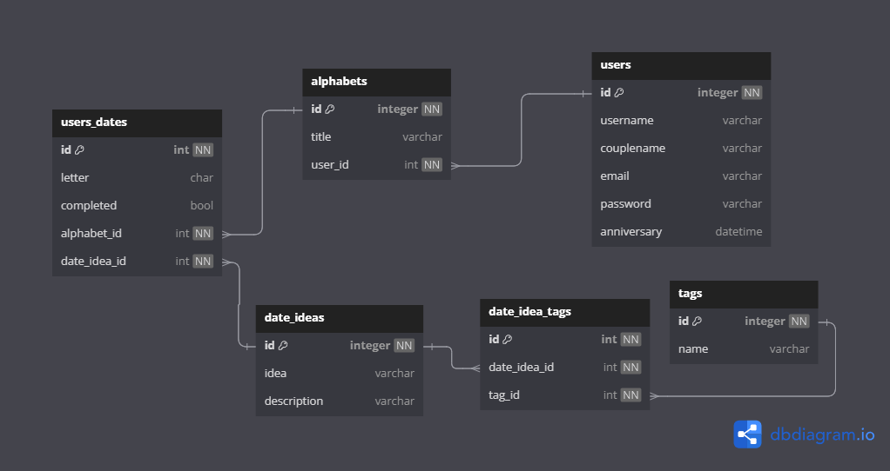

# Alphadate

<!--toc:start-->
- [Alphadate](#alphadate)
  - [Description](#description)
  - [Features](#features)
  - [Architecture](#architecture)
  - [Database](#database)
    - [database diagram](#database-diagram)
  - [Docker](#docker)
    - [Env varialbes](#env-varialbes)
    - [Build](#build)
    - [Run](#run)
<!--toc:end-->

## Description

- Manage your dates with exciting ideas and create memories <3

## Features

- Create, edit, delete and share your dates
- Filter Ideas by tags and name
- Generate a random Idea
- Manage multiple Alphabets
- Save your memories with an account
- Manage your profile

## Architecture


## Database

### database diagram



## Docker

### Env varialbes

| Name                                | Context  | Description                 | Default                                      |
| ----------------------------------- | -------- | --------------------------- | -------------------------------------------- |
| DATABASE_USER                       | Database | Username for database       | root                                         |
| DATABASE_PASS                       | Database | Password for database       | root                                         |
| DATABASE_PORT                       | Database | Port for database           | 4700                                         |
| DATABASE_HOST                       | Database | Host for database           | 0.0.0.0                                      |
| DATABASE_METHOD                     | Database | Method for database         |                                              |
| DATABASE_DBPATH                     | Database | Path for database           | /var/lib/surrealdb                           |
| BACKEND_SECRET_KEY                  | Backend  | Secret key for backend      | ZOREN4u8u4e8u4u8u4e8u4u8                     |
| BACKEND_PASSWORD_ENCRYPTION_KEY     | Backend  | Password encryption key     | 4WOLu6iFbO4XIXLTPwst1cFYEwGQ7vRUGXoOSxBWFuM= |
| BACKEND_BACKEND_PORT                | Backend  | Port for backend            | 3000                                         |
| BACKEND_HOST                        | Backend  | Host for backend            | 0.0.0.0                                      |
| BACKEND_LOG_LEVEL                   | Backend  | Log level for backend       | debug                                        |
| BACKEND_EXPIRATION_TOKEN_TIME_IN_MS | Backend  | Expiration token time in ms | 86400000                                     |
| BACKEND_DB_HOST                     | Backend  | Host for database           | 127.0.0.1:4700                               |
| BACKEND_DB_USER                     | Backend  | Username for database       | root                                         |
| BACKEND_DB_PASS                     | Backend  | Password for database       | root                                         |
| BACKEND_DB_NAMESPACE                | Backend  | Namespace for database      | alphadate                                    |
| BACKEND_DB_DATABSAE                 | Backend  | Databsae for database       | resources                                    |
| BACKEND_CORS_ORIGINS                | Backend  | CORS origins                | <http://127.0.0.1:4200>                      |

### Build

```bash
docker build -t alphadate -f docker/Dockerfile .
```

### Run

```bash
docker run -d -p 80:80 alphadate
```

### Prebuilt Image

```bash
docker pull zoren/alphadate
```
